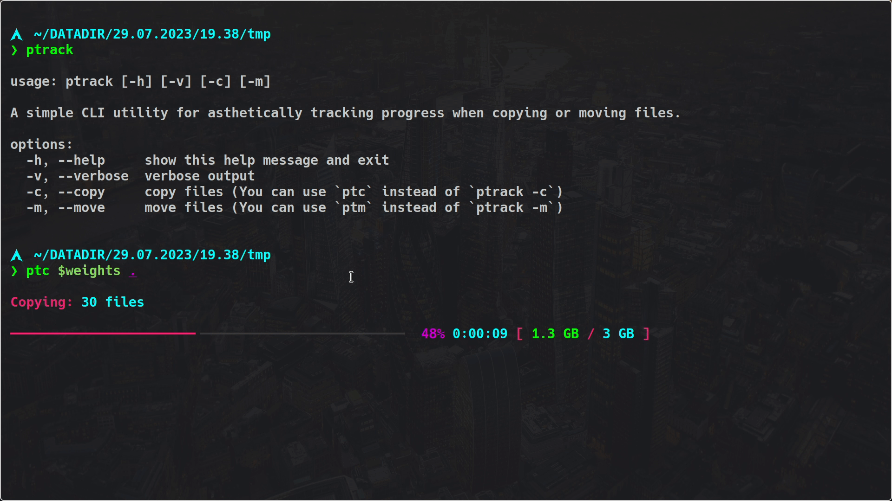

# P-Track - Progress Tracker


**Welcome to ptrack, a powerful and user-friendly command line interface (CLI) utility built to transform the way you handle file operations. Whether you're copying or moving files, ptrack provides a real-time, beautifully formatted progress bar alongside key statistics about your ongoing operation. As an incredibly efficient and performance-optimized tool, ptrack works swiftly, ensuring your file operations are completed accurately and quickly.**

*Version: 0.1.4*


## Key Features

+ Progress Bar: ptrack comes equipped with an aesthetically pleasing progress bar that updates in real-time, giving you a visual representation of your ongoing file operation.
+ Verbose Mode: If you prefer a more in-depth perspective, ptrack has a verbose mode which displays detailed information about each file being processed.
+ Copy and Move Support: Whether you need to copy or move files, ptrack has you covered. You can use ptrack with -c for copy operations and -m for move operations.
+ Interruption Handling: ptrack is built to respect your system's interruption signals. It will promptly stop operations when such signals are received, reducing the risk of data corruption.
+ High Performance: Above all, ptrack stands out for its speed and accuracy. It ensures your file operations are executed swiftly and with a high degree of precision.


## Installation

**`ptrack` can be installed through a variety of methods:**

### `PyPI`:
    pip install ptrack

### `Conda`:
    conda install -c concise ptrack

### `Arch User Repository (AUR)`:
    If you're an Arch Linux user, you can install ptrack from the AUR using an AUR helper like yay or paru: yay -S ptrack

### `From Source`:
    Clone this repository and run pip install -e . or python3 ./setup.py install

# Usage

The basic usage of ptrack isvery simple:

```bash
### For Copying
  ptc [OPTIONS] SOURCE... DESTINATION

### For Moving
  ptm [OPTIONS] SOURCE... DESTINATION
```

Refer to the User Guide for more detailed instructions and use-cases.


## Options:
+ -h, --help: Show help message and exit.
+ -v, --verbose: Enable verbose output.
+ -c, --copy: Copy files. You can use ptc instead of ptrack -c.
+ -m, --move: Move files. You can use ptm instead of ptrack -m.
+ -V, --version: Show version number and exit.





## License
`ptrack` is licenced under the MIT/X Consortium license

## Support
If you encounter any problems or have suggestions for ptrack, please open an issue on GitLab. We value your feedback and will respond as quickly as possible.


Experience the difference with ptrack – making file operations faster, more accurate, and visually pleasing!

